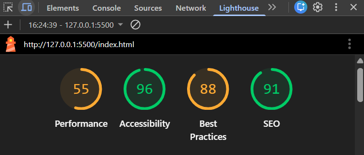

<h1 align="center">Albannian History Quiz Website</h1>

Test your knowledge on the history of Albannia and learn the history of Albannia
  

   
<a href="https://albanniahistoryquiz.netlify.app/">Website</a> • <a href="https://github.com/JonyDevelops/Albannia-History-Quiz/issues">Bug Reports</a> • <a href="https://github.com/JonyDevelops/Albannia-History-Quiz/issues">Feature Requests</a> • <a href="https://github.com/JonyDevelops/Albannia-History-Quiz/issues">Ask a Question</a>

 

   

## Project Brief
To build an online quiz where users can answer a series of questions and receive feedback or graded on their performance. 

## Built with

  
   
  
   

## HTML & CSS, JavaScript Validator Tests

#### HTML
- Fixed illegal spaces in img tags
#### CSS:
- Fixed  
#### JavaScript
- No errors
## Web Accessibility Tests
See the below lighthouse Report

 

## Challenges
- ForEach was hard for me to learn.
- event.target
 

## Future improvements
- Trigger an Event that plays background music when a user presses "Start Quiz".
- In the future I would like to retry this with React.js.
 

## Resources that helped me
- Youtube Videos
- Percipio
- Stack overFlow
 

## Deployments
This Project was deployed using netlify;
https://albanniahistoryquiz.netlify.app/

   
